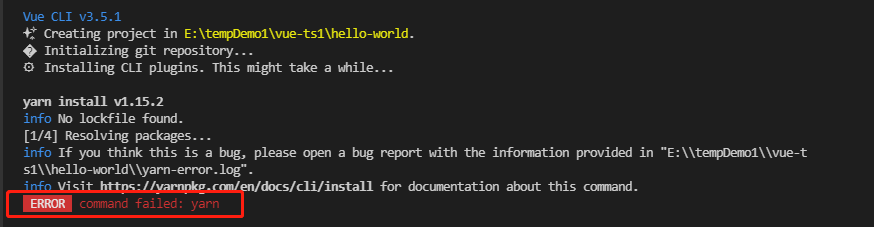

### command failed: yarn
> 错误描述：使用vue-cli3创建项目vue create vue-cli3时，报错 如图



解决方案
C:\Users\Administrator\.vuerc 编辑 把
```
{
  "useTaobaoRegistry": false,
  "packageManager": "yarn"
}
改为
{
  "useTaobaoRegistry": false,
  "packageManager": "npm"
}
```
